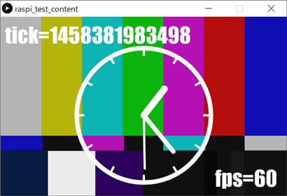

raspi_test_content
====

    auto start raspi_test_content sketch for LXDE environment.
    
    (1) install processing 3 to the raspberry pi.
    
    (2) clone sketch
        
        $ cd ~/sketchbook/
        $ git clone https://github.com/yoggy/raspi_.git
        
    (3) export executable application.
        (File -> Export Application...)
    
    (4) copy files to ~/bin/
    
        $ mkdir ~/bin/
        $ cp -r ~/sketchbook/raspi_test_content/application.linux-armv6hf/ ~/bin/
    
    (5) setup ~/.config/autostart/raspi_test_content.desktop
        
        $ mkdir -p /home/pi/.config/autostart/
        $ vi /home/pi/.config/autostart/raspi_test_content.desktop
        
        
        [Desktop Entry]
        Encoding=UTF-8
        Type=Application
        Name=RASPI_TEST_CONTENT
        Comment=
        Exec=/home/pi/bin/raspi_test_content
        StartupNotify=false
        Terminal=false
        Hidden=false

Copyright and license
----
Copyright (c) 2016 yoggy

Released under the [MIT license](LICENSE.txt)
